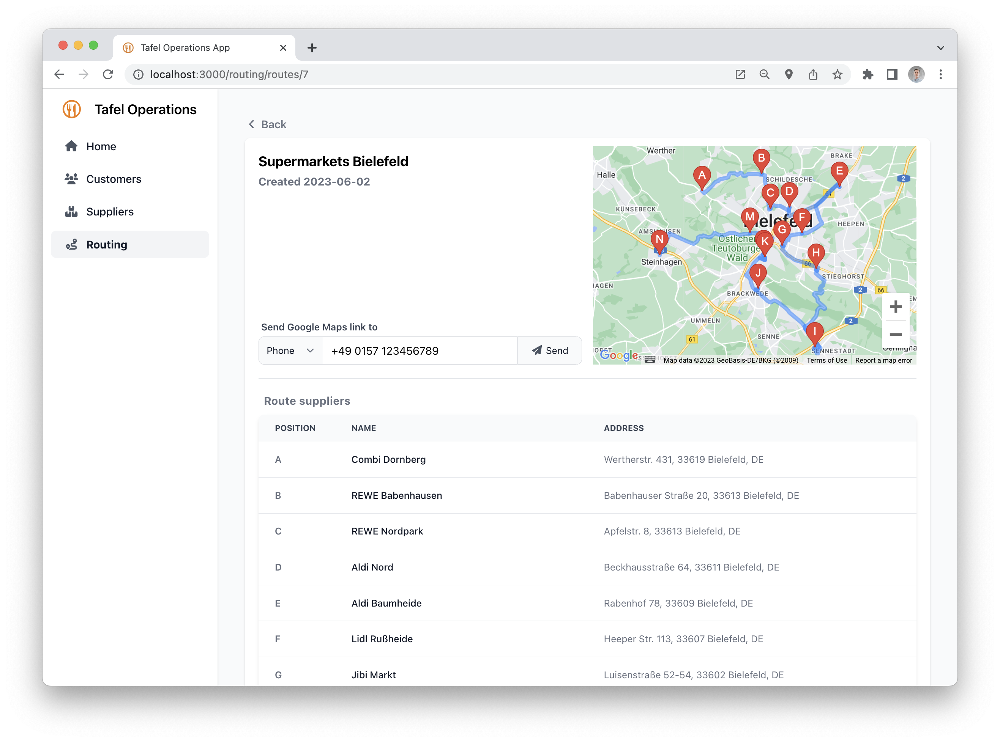

# Tafel Operations App
*This project was developed as the final project for the [CS50 Introduction to Computer Science](https://cs50.harvard.edu/x/2023/) course.*
## About
The German NGO [*Tafel Deutschland*](https://www.tafel.de/) collects food close to the best-before-date from supermarkets and redistributes it to people in need. Both when collecting the food from the suppliers and when delivering it to customers, couriers usually face one major problem:
They are given a list of 10 to 15 places to visit but do not know which route to take, i.e., in which order to visit the places. While for experienced taxi drivers it might be a no-brainer to construct a (near) optimal route from a list of addresses, especially newbies tend to spend a lot of time on either constructing the best route or following an inefficient route without planning.

The Tafel Operations App aims at solving this problem. It provides a simple interface to manage customers and suppliers with their respective addresses and gives the opportunity to create the optimal route with a couple of clicks. The created route can then be saved to be reused and can also be sent as a GoogleMaps link to the device of the driver. Thereby, drivers are ready to depart within a few seconds.


<sub><sup>A sample resulting route</sup></sub>

## Setup
To get the app running locally, run the frontend, API, and database in Docker:

1. Make sure you have the [Docker desktop client](https://www.docker.com/products/docker-desktop/) installed and running. 

2. Pull the latest Postgres image by running
    ```sh
    docker pull postgres
    ```

3. `cd` in the cloned directory and build the containers for the web app by running
    ```sh
    docker-compose up
    ```

4. You should now see the `tafel-operations` container running in Docker.

5. You can reach the application through `http://localhost:3000/` in your browser.


## Tech stack
### Frontend
- React.js
- HTML
- Tailwind CSS

### API
- FastAPI (Python)

### Backend
- PostgreSQL
- SQLAlchemy ORM (Python)